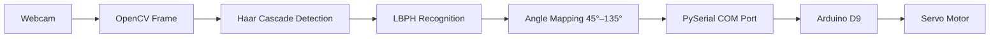

# Servo Facial Tracking

A Python-based face recognition and tracking system that trains a custom **Local Binary Patterns Histograms (LBPH)** model on your face, detects you in real time through a webcam, and optionally drives an Arduino servo to follow your horizontal movement.

The full workflow is managed from a themed **Tkinter control dashboard** — capture samples, train the model, launch tracking, and configure serial hardware without touching the command line.

---

## Table of Contents

- [Overview](#overview)
- [Features](#features)
- [System Requirements](#system-requirements)
- [Hardware & Wiring](#hardware--wiring)
- [Project Structure](#project-structure)
- [Installation](#installation)
- [Quick Start](#quick-start)
- [Usage Guide](#usage-guide)
- [Keyboard Controls](#keyboard-controls)
- [Configuration Reference](#configuration-reference)
- [Architecture](#architecture)
- [Privacy & Local Data](#privacy--local-data)
- [Troubleshooting](#troubleshooting)
- [License](#license)

---

## Overview

| Component | Role |
|-----------|------|
| **Webcam** | Captures training samples and live tracking frames |
| **OpenCV Haar Cascade** | Locates face bounding boxes in each frame |
| **LBPH Recognizer** | Verifies the detected face matches your trained identity |
| **Python + PySerial** | Maps face position to a servo angle and sends it over serial |
| **Arduino (Uno / Nano)** | Receives angle commands and drives the servo on pin D9 |

**Typical workflow:** Capture face samples → train LBPH model → run tracker → servo pans to keep your face centered.

---

## Features

- **Control dashboard** — Launch trainer, LBPH tracker, or basic tracker from one GUI with live activity logging
- **Custom face training** — Capture normalized 200×200 face crops locally and build a private `face_model.xml`
- **LBPH verification** — Only tracks faces that match your trained identity (label `0`, confidence threshold `< 70`)
- **Smooth servo mapping** — Position averaging, deadzone, velocity limiting, and easing reduce jitter
- **Manual override** — Nudge the servo with momentum using `A` / `D` keys
- **Optional hardware** — Run recognition-only without Arduino, or enable serial control from the GUI
- **Privacy-first** — Dataset images, trained models, and demo recordings stay on your machine

---

## System Requirements

### Software

| Tool | Purpose |
|------|---------|
| **Python 3.10+** | GUI, trainer, tracker, and serial bridge |
| **Arduino IDE** | Upload the servo sketch to your board |
| **Webcam** | Training capture and live tracking |

### Python Dependencies

| Package | Purpose |
|---------|---------|
| `opencv-contrib-python` | Face detection, LBPH training/recognition |
| `numpy` | Angle math and smoothing |
| `pyserial` | Arduino serial communication |

### Hardware

| Part | Notes |
|------|-------|
| **Arduino Uno or Nano** | Any board supported by the Servo library |
| **Standard hobby servo** | SG90, MG90S, or similar (180° range) |
| **Jumper wires** | Signal, power, and ground |
| **USB cable** | Arduino programming and serial link to PC |
| **External 5 V supply** *(recommended)* | For larger servos — see [Power notes](#power-notes) |

---

## Hardware & Wiring

### Pin Summary

| Connection | Arduino Pin | Servo Wire (typical) |
|------------|-------------|----------------------|
| Signal | **D9** | Orange or yellow |
| Power (VCC) | **5 V** | Red |
| Ground (GND) | **GND** | Brown or black |

> **Serial settings:** 9600 baud. Python sends one angle per line (e.g. `90\n`). Valid range on the Arduino side is clamped to **0–180°**; the tracker maps face position to **45–135°** by default.

---

### Wiring Diagram — Arduino Uno

```
                    ┌─────────────────────────────┐
                    │        ARDUINO UNO          │
                    │                             │
    PC (USB) ───────┤ USB                         │
                    │                             │
                    │  D9  ●──────────────────────┼────── Signal (Orange/Yellow)
                    │                             │              │
                    │  5V  ●──────────────────────┼────── VCC (Red)
                    │                             │              │
                    │ GND  ●──────────────────────┼────── GND (Brown/Black)
                    │                             │              │
                    └─────────────────────────────┘              │
                                                                   ▼
                                                          ┌────────────────┐
                                                          │  SERVO MOTOR   │
                                                          │   (SG90 etc.)  │
                                                          └────────────────┘
```

---

### Wiring Diagram — Arduino Nano

```
                    ┌─────────────────────────────┐
                    │       ARDUINO NANO          │
                    │                             │
    PC (USB) ───────┤ Mini-USB / USB-C            │
                    │                             │
                    │  D9  ●──────────────────────┼────── Signal
                    │  5V  ●──────────────────────┼────── VCC
                    │ GND  ●──────────────────────┼────── GND
                    │                             │
                    └─────────────────────────────┘
                                    │
                                    ▼
                              [ Servo Motor ]
```

---

### Recommended Setup — External Power (larger servos)

Small SG90 servos can often run from the Arduino 5 V pin. Heavier servos should use a **separate 5 V supply** with a **shared ground**:

```
   ┌──────────────┐                              ┌──────────────┐
   │  5V Supply   │                              │   ARDUINO    │
   │  (+ terminal)├──────────────────────────────┤ 5V (optional)│
   │  (- terminal)├───┬──────────────────────────┤ GND          │
   └──────────────┘   │                          │ D9 ── Signal │
                      │                          └──────┬───────┘
                      │                                 │
                      │         ┌───────────────────────┤
                      │         │                       │
                      ▼         ▼                       ▼
                 ┌─────────────────────────────────────────┐
                 │              SERVO MOTOR                  │
                 │   GND ◄── shared ground                   │
                 │   VCC ◄── 5V from external supply         │
                 │   SIG ◄── D9 from Arduino                 │
                 └─────────────────────────────────────────┘
```

> **Important:** Always connect the external supply **GND** to Arduino **GND**. Never power a high-current servo only through the Arduino 5 V pin.

---

### Signal Flow



---

## Project Structure

```
face tracker/
├── face_tracker_gui.py          # Main dashboard — start here
├── face.py                      # Basic Haar-only tracker (no LBPH)
├── requirements.txt             # Python dependencies
├── README.md
│
├── custom face/
│   ├── train_lbph.py            # Capture samples + train model
│   ├── face_tracker_lbph.py     # LBPH recognition + servo tracking
│   └── face_model.xml           # Generated after training (local)
│
├── dataset/                     # Generated face images (local, private)
│
├── facearduino/
│   └── facearduino.ino          # Arduino sketch — upload to board
│
└── vids/                        # Optional demo recordings (local)
```

---

## Installation

### 1. Clone or download the project

Keep the folder layout intact so the GUI can resolve relative paths to scripts, the dataset, and the Arduino sketch.

```powershell
cd "C:\path\to\face tracker"
```

### 2. Create a virtual environment

```powershell
py -m venv .venv
.\.venv\Scripts\Activate.ps1
python -m pip install --upgrade pip
python -m pip install -r requirements.txt
```

### 3. Upload the Arduino sketch

1. Open `facearduino/facearduino.ino` in the **Arduino IDE**
2. Wire the servo to **D9**, **5V**, and **GND** (see [wiring diagrams](#hardware--wiring))
3. Select your board (Uno / Nano) and the correct **COM port**
4. Upload the sketch
5. Note the COM port name shown in the IDE (e.g. `COM10`) — you will enter it in the GUI

### 4. Verify setup

From the project folder with the venv active:

```powershell
python -c "import cv2; cv2.face.LBPHFaceRecognizer_create(); print('OK')"
```

You can also click **Check Setup** in the dashboard sidebar.

---

## Quick Start

```powershell
.\.venv\Scripts\Activate.ps1
python face_tracker_gui.py
```

1. **Train** — Click *Start Training*, press **Space** when your face is detected, press **Q** when finished
2. **Configure hardware** — Enter your COM port and toggle **Arduino ON** if using a servo
3. **Track** — Click *Start Tracker* to run the LBPH tracker with your trained model

---

## Usage Guide

### Step 1 — Train your face model

Launch **Train Face Model** from the dashboard (or run `custom face/train_lbph.py` directly).

| Action | Key |
|--------|-----|
| Capture a face sample | **Space** |
| Finish and save model | **Q** |

- Samples are saved to `dataset/` as 200×200 grayscale crops
- Training produces `custom face/face_model.xml`
- Aim for **20–50 varied samples** (different angles, lighting, distance) for reliable recognition

### Step 2 — Configure Arduino (optional)

In the **Arduino Access** panel:

| Setting | Description |
|---------|-------------|
| **Arduino ON/OFF** | Enables serial output when starting a tracker |
| **COM Port** | Your board's port (e.g. `COM10`) — click **Use** to apply |

These values are passed as environment variables when a tracker starts:

```
FACE_TRACKER_USE_ARDUINO=1
FACE_TRACKER_COM_PORT=COM10
```

### Step 3 — Run the LBPH tracker

Launch **Run LBPH Tracker** after `face_model.xml` exists.

The tracker will:

1. Open the webcam (DirectShow on Windows)
2. Detect faces with a Haar cascade
3. Run LBPH recognition — only **your** face (label `0`, confidence `< 70`) drives the servo
4. Map horizontal face position to a servo angle between **45°** and **135°**
5. Send angles over serial at 9600 baud when Arduino access is enabled

### Basic tracker (no training required)

**Run Basic Tracker** launches `face.py` — a simpler Haar-cascade tracker that follows any detected face without LBPH verification. Useful for quick camera and servo tests.

---

## Keyboard Controls

### Training (`train_lbph.py`)

| Key | Action |
|-----|--------|
| **Space** | Capture current face into `dataset/` |
| **Q** | Stop capture, train model, save `face_model.xml` |

### LBPH Tracker (`face_tracker_lbph.py`)

| Key | Action |
|-----|--------|
| **Q** | Quit |
| **C** | Center servo to 90° |
| **R** | Move servo to minimum angle (45°) |
| **I** | Invert left/right mapping |
| **P** | Pause servo output |
| **A** / **D** | Manual nudge left / right (with momentum) |

### Basic Tracker (`face.py`)

| Key | Action |
|-----|--------|
| **Q** | Quit |
| **C** | Center servo |
| **R** | Move to 0° |
| **I** | Invert mapping |
| **P** | Pause output |
| **S** | Toggle servo enable |

---

## Configuration Reference

Settings are defined at the top of each tracker script. Common values:

| Parameter | Default | Description |
|-----------|---------|-------------|
| `COM_PORT` | `COM10` | Serial port (overridden by GUI) |
| `BAUD` | `9600` | Must match Arduino sketch |
| `SERVO_MIN` / `SERVO_MAX` | `45` / `135` | Tracker angle range |
| `CENTER` | `90` | Neutral / home position |
| `DEADZONE_PCT` | `0.04` | ±4% of frame width — no movement inside |
| `SMOOTH_A` | varies | Smoothing factor (lower = smoother) |

Environment variables (set automatically by the GUI):

| Variable | Values | Effect |
|----------|--------|--------|
| `FACE_TRACKER_USE_ARDUINO` | `1` / `0` | Enable or disable serial output |
| `FACE_TRACKER_COM_PORT` | e.g. `COM10` | Target serial port |

---

## Architecture

```
┌─────────────┐     ┌──────────────────┐     ┌─────────────────┐
│   Webcam    │────▶│  Grayscale Frame │────▶│  Haar Cascade   │
└─────────────┘     └──────────────────┘     └────────┬────────┘
                                                       │
                                                       ▼
                                              ┌─────────────────┐
                                              │  LBPH Predict   │
                                              │  (face_model)   │
                                              └────────┬────────┘
                                                       │
                                                       ▼
                                              ┌─────────────────┐
                                              │ Smooth + Map    │
                                              │ 45° – 135°      │
                                              └────────┬────────┘
                                                       │
                                                       ▼
┌─────────────┐     ┌──────────────────┐     ┌─────────────────┐
│ Servo D9    │◀────│  Arduino 9600    │◀────│  PySerial       │
└─────────────┘     └──────────────────┘     └─────────────────┘
```

**Dashboard role:** `face_tracker_gui.py` spawns trainer/tracker subprocesses, streams their output to the activity log, and injects Arduino settings via environment variables.

---

## Privacy & Local Data

The following files are **generated on your computer** and should **not** be published or committed to public repositories:

| Path | Contents |
|------|----------|
| `dataset/` | Your face training images |
| `custom face/face_model.xml` | Trained LBPH biometric model |
| `vids/` | Demo recordings (if created) |

All biometric processing runs offline. No data is sent to external services.

---

## Troubleshooting

| Problem | Likely cause | Fix |
|---------|--------------|-----|
| `Model file not found` | Training not completed | Run the trainer and press **Q** to save the model |
| `Camera not found` | Webcam in use or disconnected | Close other camera apps; check USB connection |
| `Could not connect to Arduino` | Wrong COM port or sketch not uploaded | Verify port in Device Manager; re-upload `facearduino.ino` |
| Servo jitters or overshoots | Aggressive smoothing / power issue | Lower `MAX_VELOCITY`; use external 5 V supply |
| Face not recognized | Too few training samples | Recapture 20+ images with varied lighting and angles |
| `LBPHFaceRecognizer_create` error | Wrong OpenCV package | Install `opencv-contrib-python`, not `opencv-python` |
| COM port busy | Serial Monitor open in Arduino IDE | Close Serial Monitor before starting the tracker |

### Finding your COM port (Windows)

1. Open **Device Manager**
2. Expand **Ports (COM & LPT)**
3. Look for **Arduino Uno** or **USB-SERIAL CH340** — note the COM number

4. **AI Usage Declaration**
I have used Agentic AI in this project
---

## License

This project is open source under the [MIT License](LICENSE).

---

## Links

- [Project website & setup guide](https://vash-codex.github.io/Servo-Facial-Tracking/)
- [GitHub repository](https://github.com/vash-codex/Servo-Facial-Tracking)
